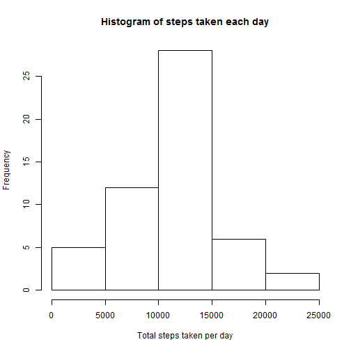
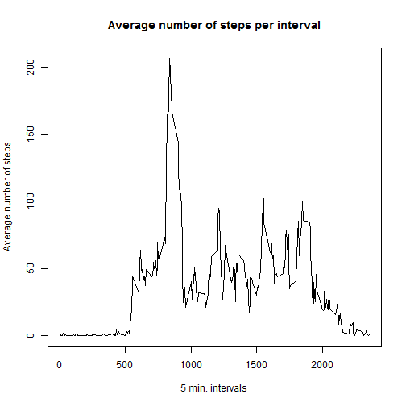
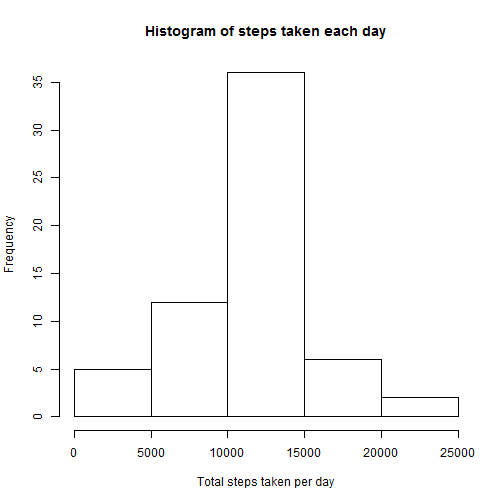
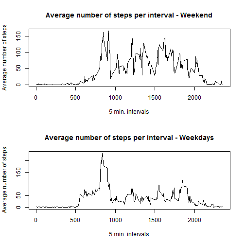

Reproducible Research Assignment - Activity Monitoring
===

---
title: "PA1_template"
author: "Roland Kiss"
date: "May 14, 2016"
output: html_document
---

This R Markdown document contains the data analysis exercise related to the "Activity Monitoring Data" dataset, including the following sections:

- Code for reading in the dataset and/or processing the data
- Histogram of the total number of steps taken each day
- Mean and median number of steps taken each day
- Time series plot of the average number of steps taken
- The 5-minute interval that, on average, contains the maximum number of steps
- Code to describe and show a strategy for imputing missing data
- Histogram of the total number of steps taken each day after missing values are imputed
- Panel plot comparing the average number of steps taken per 5-minute interval across weekdays and weekends


Section 1: Code for opening and processing the data

The below code assumes that the data is saved into the working directory of the user.


```r
data<-read.csv("activity.csv",colClasses=c("numeric", "character", "numeric"))
data$date <- as.Date(data$date, format = "%Y-%m-%d")
head(data)
```

```
##   steps       date interval
## 1    NA 2012-10-01        0
## 2    NA 2012-10-01        5
## 3    NA 2012-10-01       10
## 4    NA 2012-10-01       15
## 5    NA 2012-10-01       20
## 6    NA 2012-10-01       25
```


Section 2: Histogram of the total number of steps taken each day


```r
library(dplyr)
newdata<-group_by(data,date)
totalstepsdata<-summarize(newdata,totalsteps=sum(steps))
hist(totalstepsdata$totalsteps,main="Histogram of steps taken each day",xlab="Total steps taken per day")
```




Section 3: Mean and Median number of steps taken each day


```r
meansteps<-mean(totalstepsdata$totalsteps,na.rm=TRUE)
meanstepsprint<-paste("Mean number of steps taken each day is:",meansteps)
print(meanstepsprint)
```

```
## [1] "Mean number of steps taken each day is: 10766.1886792453"
```


```r
mediansteps<-median(totalstepsdata$totalsteps,na.rm=TRUE)
medianstepsprint<-paste("Median number of steps taken each day is:",mediansteps)
print(medianstepsprint)
```

```
## [1] "Median number of steps taken each day is: 10765"
```


Section 4: Time series plot of the average number of steps taken each day


```r
newdataaverage<-group_by(data,interval)
averagestepsdata<-summarize(newdataaverage,averagesteps=mean(steps,na.rm=TRUE))
plot(averagestepsdata$interval,averagestepsdata$averagesteps,main="Average number of steps per interval",xlab="5 min. intervals",ylab="Average number of steps",type="l")
```




Section 4: The 5 minute interval that on average has the maximum number of steps taken across all days


```r
averagestepsdata<-summarize(newdataaverage,averagesteps=mean(steps,na.rm=TRUE))
maxtomin<-arrange(averagestepsdata,desc(averagesteps))
maxstepsinterval<-paste("The time interval with the maximum number of steps taken each day is:",substr(maxtomin[1,1],1,nchar(maxtomin[1,1])-2),":",substr(maxtomin[1,1],nchar(maxtomin[1,1])-1,nchar(maxtomin[1,1])))
print(maxstepsinterval)
```

```
## [1] "The time interval with the maximum number of steps taken each day is: 8 : 35"
```


Section 5: Replacing the "NA" values in the dataset with the average value of the same 5 minute interval accross all days.

The data set before replacing the "NA" values

```r
head(data)
```

```
##   steps       date interval
## 1    NA 2012-10-01        0
## 2    NA 2012-10-01        5
## 3    NA 2012-10-01       10
## 4    NA 2012-10-01       15
## 5    NA 2012-10-01       20
## 6    NA 2012-10-01       25
```


The process of replacing the "NA" values and the dataset after the replacement of the "NA" values:

```r
datamerged<-merge(data,averagestepsdata,by.x="interval",by.y="interval",sort=FALSE)
datamerged<-arrange(datamerged,date)
navector<-which(is.na(data[,1]))
data[navector,1]<-datamerged[navector,4]

head(data)
```

```
##       steps       date interval
## 1 1.7169811 2012-10-01        0
## 2 0.3396226 2012-10-01        5
## 3 0.1320755 2012-10-01       10
## 4 0.1509434 2012-10-01       15
## 5 0.0754717 2012-10-01       20
## 6 2.0943396 2012-10-01       25
```

Section 6: Histogram of the total number of steps taken each day after replacing the "NA" values in the dataset


```r
dataimputted<-group_by(data,date)
totalstepsdataimputted<-summarize(dataimputted,totalsteps=sum(steps))
hist(totalstepsdataimputted$totalsteps,main="Histogram of steps taken each day",xlab="Total steps taken per day")
```



```r
head(data)
```

```
##       steps       date interval
## 1 1.7169811 2012-10-01        0
## 2 0.3396226 2012-10-01        5
## 3 0.1320755 2012-10-01       10
## 4 0.1509434 2012-10-01       15
## 5 0.0754717 2012-10-01       20
## 6 2.0943396 2012-10-01       25
```


Section 7: Plotting the differences between the average number of steps taken on weekdays and weekends.


```r
data[,4]<-weekdays(as.Date(data[,2]))
data[,5]<-ifelse(data[,4]=="Saturday"|data[,4]=="Sunday","Weekend","Weekday")
weekend<-subset(data,data[,5]=="Weekend")
weekday<-subset(data,data[,5]=="Weekday")

weekendaverage<-group_by(weekend,interval)
weekendaveragedata<-summarize(weekendaverage,averagesteps=mean(steps,na.rm=TRUE))

weekdayaverage<-group_by(weekday,interval)
weekdayaveragedata<-summarize(weekdayaverage,averagesteps=mean(steps,na.rm=TRUE))

par(mfrow=c(2,1))
plot(weekendaveragedata$interval,weekendaveragedata$averagesteps,main="Average number of steps per interval - Weekend",xlab="5 min. intervals",ylab="Average number of steps",type="l")
plot(weekdayaveragedata$interval,weekdayaveragedata$averagesteps,main="Average number of steps per interval - Weekdays",xlab="5 min. intervals",ylab="Average number of steps",type="l")
```



